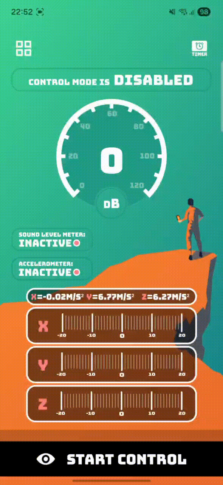
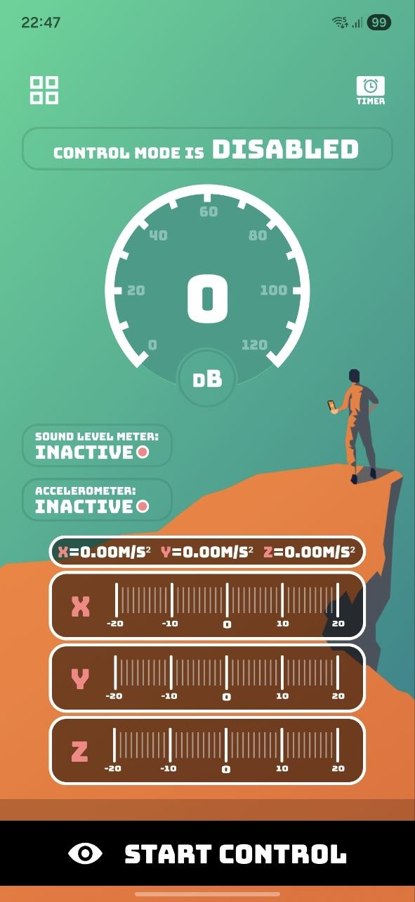
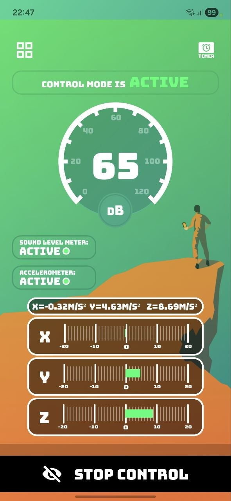
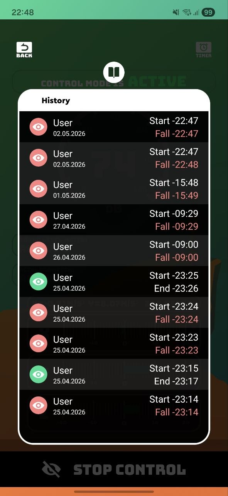
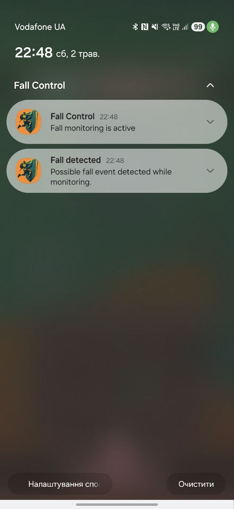

# FallControl

FallControl is a personal Android project for real-time fall detection using device sensors. The app combines accelerometer-based movement analysis with microphone sound level monitoring, stores local fall history, and notifies the user when a possible fall event is detected.

This is an older project that I recently revisited and refined to make it more portfolio-ready. During the latest iteration I focused on moving monitoring logic out of the UI layer, running fall detection in a foreground service, adding system notifications for detected falls, and improving how the app restores active monitoring state.

## Highlights

- Real-time fall detection using `SensorManager` and accelerometer data
- Sound level monitoring with `MediaRecorder`
- Background monitoring through a dedicated `ForegroundService`
- Alert notifications when a possible fall is detected
- Ongoing notification while fall monitoring is active
- Local fall history with start time, end time, sensor values, and sound level
- Timer-based monitoring mode
- Monitoring restoration after device reboot
- Runtime permission flow for microphone and notification access
- Debounced fall events to avoid duplicate alerts from multiple sensors
- Google Play Billing integration for unlocking the full monitoring mode

## Demo

  

The demo shows the main monitoring flow: enabling control mode, receiving live sensor and sound updates, triggering a possible fall event, showing a system notification, and saving the event in history.

> Demo note: the current detection thresholds are tuned for presentation, so an alert can be triggered by a sharp phone movement or a loud sound instead of requiring a real fall.

## Screenshots

  
  
  

  

## What I Improved

The original version was a simpler Android app focused mostly on the UI and basic sensor interaction. I revisited it to make the core behavior closer to a real Android background feature: monitoring now works outside the visible screen, fall events are propagated through the app state, and alerts are delivered through system notifications.

### Background Fall Monitoring

Fall monitoring was moved into `FallDetectionService`, a foreground service that can keep the accelerometer and microphone monitoring active while the app is in the background. The service observes user settings from Room and starts or stops each sensor depending on the current control mode.

The service also creates separate notification channels for ongoing monitoring and fall alerts. This makes the app compatible with modern Android background execution rules and gives the user visible feedback that monitoring is active.

### Fall Detection Flow

The accelerometer detector calculates the movement magnitude from X, Y, and Z values and compares the impact delta against a threshold. This makes detection based on the overall force of the movement rather than only a single axis.

The microphone detector reads audio amplitude through `MediaRecorder`, converts it into a normalized sound level, and can trigger a fall event when the sound level crosses the configured threshold.

### Event Synchronization

The app uses Room and Flow-based state observation to keep the UI, repositories, and foreground service synchronized. When control mode changes, the service reacts to the same stored state as the UI, which keeps sensor lifecycle logic consistent.

Fall events are debounced at the repository level, so a single incident detected by both accelerometer and microphone does not create duplicate history entries or repeated alerts.

### History and Timer Mode

Detected events are saved into local fall history with timestamps and sensor data. The app also supports timer-based monitoring: the user can start monitoring for a limited period, and the timer state is stored locally so it can be restored after process recreation.

### Permissions and System Behavior

The project includes runtime handling for microphone access and notification permission on newer Android versions. If permissions are missing, the app explains why they are required and guides the user to grant them before starting monitoring.

## Tech Stack

- Kotlin
- Android SDK
- MVVM-style presentation layer
- ViewBinding
- Room
- Coroutines
- Flow / SharedFlow
- Koin
- Navigation Component
- Foreground Services
- SensorManager
- MediaRecorder
- NotificationCompat
- BroadcastReceiver
- Google Play Billing

## Android APIs Used

- `SensorManager` and `TYPE_ACCELEROMETER` for movement monitoring
- `MediaRecorder` for microphone sound level monitoring
- `ForegroundService` for background fall detection
- `NotificationChannel` and `NotificationCompat` for monitoring and alert notifications
- `BroadcastReceiver` and `BOOT_COMPLETED` for restoring monitoring after reboot
- Runtime permissions for microphone and notification access
- Room database for local settings and fall history
- Google Play Billing for full-mode unlock flow

## Project Status

This is a portfolio project focused on demonstrating Android development skills: sensor handling, background services, system notifications, local persistence, runtime permissions, coroutine-based synchronization, and integration with Android system lifecycle constraints.

## Requirements

- Android Studio
- JDK 17
- Android SDK 35
- Minimum SDK 24

## Running the Project

1. Clone the repository.
2. Open the project in Android Studio.
3. Sync Gradle.
4. Run the `app` configuration on an emulator or physical device.

For the full monitoring flow, grant microphone and notification permissions when prompted. A physical device is recommended because accelerometer and microphone behavior is limited on most emulators.
